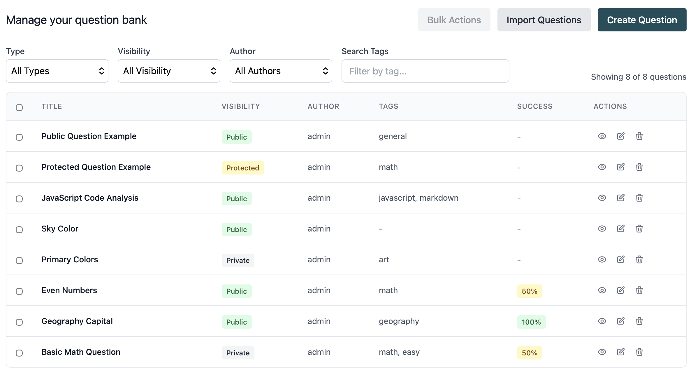
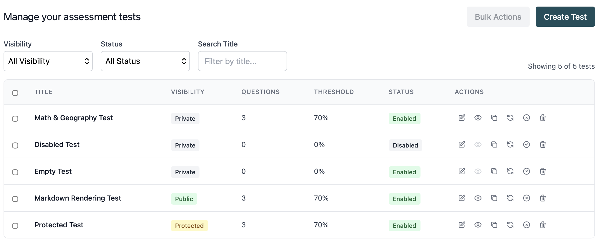

# Clever Badge

[](https://codecov.io/gh/jnury/cleverbadge)
[](LICENSE)

**Online skills assessment platform** - Create MCQ tests, share links with candidates, review results with analytics.


## What is Clever Badge?

Clever Badge lets you create and manage skills assessment tests without the complexity of enterprise solutions. Candidates take tests via simple shareable links - no accounts required. Administrators get a clean dashboard to manage questions, tests, and analyze results.

**Live Demo:** [cleverbadge.onrender.com](https://cleverbadge.onrender.com)

---

## Features

### For Candidates
- **No account required** - Start tests instantly via shareable links
- **Clean test experience** - One question per page with progress indicator
- **Mobile-friendly** - Works on any device
- **Instant results** - See score immediately after submission

### For Administrators
- **Question management** - Create, edit, import via YAML, organize with tags
- **Flexible test builder** - Combine questions with custom weights
- **Visibility controls** - Public, private, or protected tests
- **Markdown support** - Code syntax highlighting in questions
- **Detailed results** - See exactly how each candidate answered
- **Analytics** - Identify difficult questions with success rate stats
- **Multi-environment** - Development, staging, production isolation

### Question Types
| Type | Description |
|------|-------------|
| **Single Choice** | One correct answer |
| **Multiple Choice** | Multiple correct answers, all must be selected |
| **Weighted Scoring** | Assign importance to each question |

---

## Screenshots

<details>
<summary>Click to view screenshots</summary>

### Candidate Experience
| Test Question | Results |
|---------------|---------|
|  |  |

### Answer Review with Explanations


### Admin Dashboard
| Question Bank | Test Management |
|---------------|-----------------|
|  |  |

| Assessment Results | Analytics |
|--------------------|-----------|
|  |  |

</details>

---

## Quick Start

```bash
# Clone and install
git clone https://github.com/jnury/cleverbadge.git
cd CleverBadge
cd backend && npm install
cd ../frontend && npm install

# See full setup guide
open docs/DEVELOPMENT.md
```

**Prerequisites:** Node.js 18+, PostgreSQL 14+

For complete setup instructions including database configuration, see **[Development Guide](docs/DEVELOPMENT.md)**.

---

## Roadmap

### v1.0 - MVP (Current)
- [x] Shareable test links
- [x] Single & multiple choice questions
- [x] Weighted scoring
- [x] Admin dashboard with full CRUD
- [x] YAML question import
- [x] Markdown with syntax highlighting
- [x] Per-question analytics
- [x] Detailed assessment results

### v2.0 - Enhanced Experience (Planned)
- [ ] **Time limits** - Per-test and per-question timers
- [ ] **Question randomization** - Shuffle questions and options
- [ ] **Export results** - CSV/PDF export for assessments
- [ ] **Analytics charts** - Visual dashboard with graphs
- [ ] **User management** - Multiple admin users with roles
- [ ] **GDPR compliance** - Data retention and deletion tools

### Future Considerations
- Email notifications for completed assessments
- Custom branding per test
- API for external integrations
- Question versioning and history

See [docs/plans/](docs/plans/) for detailed feature designs.

---

## Documentation

| Document | Description |
|----------|-------------|
| **[Development Guide](docs/DEVELOPMENT.md)** | Local setup, testing, deployment |
| **[Architecture](docs/ARCHITECTURE.md)** | Tech stack, project structure, key patterns |
| **[API Reference](docs/API.md)** | Complete endpoint documentation |
| **[Database Schema](docs/DATABASE.md)** | Tables, relationships, queries |
| **[Changelog](docs/CHANGELOG.md)** | Version history and technical decisions |

---

## Tech Stack

| Layer | Technology |
|-------|------------|
| **Backend** | Node.js, Express, PostgreSQL |
| **Frontend** | React, Vite, Tailwind CSS |
| **Testing** | Vitest, Playwright |
| **Deployment** | Render.com |

JavaScript only (no TypeScript) - see [Architecture](docs/ARCHITECTURE.md) for details.

---

## Contributing

This is a personal project developed with AI assistance (Claude Code).

For questions or issues, please [open a GitHub issue](https://github.com/jnury/cleverbadge/issues).

## License

MIT License - see [LICENSE](LICENSE) for details.
